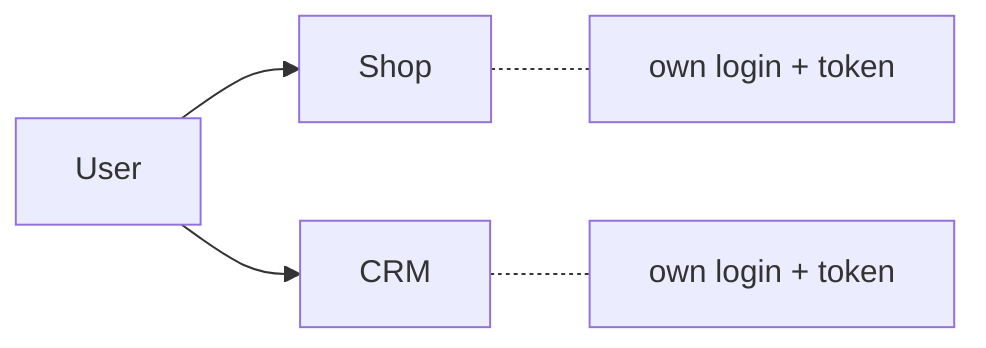
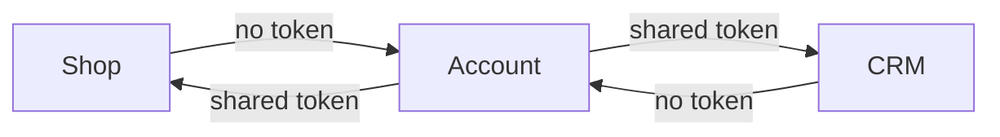
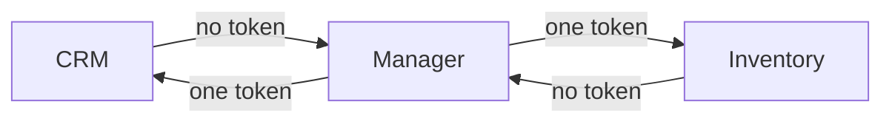

# `@pinooxhq/auth`

Auth for Pinoox themes — **configured in PHP, zero hardcoding in the SPA**.

Token storage, authorized HTTP, `me()` / logout, and login redirects for **Vue**, **React**, and **Svelte**. Values come from `window.__PINOOX__.auth` (published by `auth.client` in `app.php`).

## Contents

1. [Schematics & how it works](#1-schematics--how-it-works) ← **start here**
2. [Setup guide — Independent](#2-setup-guide--independent)
3. [Setup guide — SSO](#3-setup-guide--sso)
4. [Platform variant](#4-platform-variant)
5. [Quick theme module](#5-quick-theme-module)
6. [Why `auth.client`?](#6-why-authclient)
7. [App configuration reference](#7-app-configuration-reference)
8. [Theme integration](#8-theme-integration)
9. [HTTP, redirects, adapters](#9-http-redirects-adapters)
10. [API reference](#10-api-reference)
11. [Vite](#11-vite)

---

## 1. Schematics & how it works

Two layers always work together:

| Layer | Where | What it controls |
| ----- | ----- | ---------------- |
| **`transport`** | `app.php` | Which app owns **users / JWT secret / token key** on the server |
| **`auth.client`** | `app.php` → `__PINOOX__.auth` | What the **SPA** knows: strategy, login URL, API endpoints |

### Independent mode

Each app logs users in by itself. Tokens are **not** shared.



**How it works**

1. `app.php`: `auth.mode` + `auth.key` + `client => true` (no `transport`).
2. Strategy is **`local`** — login UI lives in this app.
3. Login issues a JWT stored under that app’s `auth.key`.
4. `me` / `logout` hit **this** app’s API only.

---

### SSO mode (one login + dependents)

One app (`com_pinoox_account`) is the login. Shop and CRM reuse the **same** session.



**How it works**

1. **Account** owns users + `auth.key` (local login).
2. **Shop / CRM**: `transport.user => com_pinoox_account` + `strategy: remote`.
3. Guest → redirect to Account → login → back with `?redirect=`.
4. Same browser key unlocks every dependent app.

| | Account | Shop / CRM |
| - | ------- | ---------- |
| Login | Yes | No |
| Token key | Defines it | Shared via `transport` |
| Strategy | `local` | `remote` |
---

## 2. Setup guide — Independent

Goal: Shop has its own login. CRM is unrelated (or also independent with a different key).

### Step 1 — `app.php`

```php
// apps/com_pinoox_shop/app.php
return [
    'package' => 'com_pinoox_shop',
    // … theme, router, …

    // no 'transport' → local users + local auth

    'auth' => [
        'mode' => 'jwt',
        'key' => 'pinoox_shop_auth',
        'lifetime' => 30,
        'lifetime_unit' => 'day',
        'client' => true,
    ],
];
```

```bash
php pinoox pinker:rebuild com_pinoox_shop -n
```

### Step 2 — Theme auth module

```bash
cd apps/com_pinoox_shop/theme/default
npm install @pinooxhq/auth axios
```

```js
// src/utils/auth/index.js
import axios from 'axios'
import { defineStore } from 'pinia'
import { createAuth, createHttp } from '@pinooxhq/auth'
import { createPiniaAuthStore } from '@pinooxhq/auth/vue'

export const auth = createAuth({ debug: import.meta.env.DEV })
export const http = createHttp({ auth, axios })
export const useAuthStore = createPiniaAuthStore(defineStore, 'auth')
```

### Step 3 — Login page

```vue
<script setup>
import { http, useAuthStore } from '@/utils/auth'
import { useAuthRedirect } from '@pinooxhq/auth/vue'

const store = useAuthStore()
const { redirectBack } = useAuthRedirect()

const onLogin = async () => {
  const { data } = await http.post('auth/login', { username, password })
  const body = data?.data ?? data
  store.login(body.token, body.user)
  redirectBack()
}
</script>
```

### Step 4 — Guard

```js
import { useAuthStore } from '@/utils/auth'

export async function authGuard(to, _from, next) {
  const store = useAuthStore()
  store.syncTokenFromStorage()
  if (!store.isAuth) await store.canUserAccess(true)
  if (to.meta.requiresAuth && !store.isAuth) {
    return next({ name: 'login', query: { redirect: to.fullPath } })
  }
  next()
}
```

### Checklist

- [ ] `auth.mode` + `auth.key` on this app
- [ ] `auth.client => true`
- [ ] Login UI in **this** theme
- [ ] Do **not** set `strategy: remote`
- [ ] Twig: `pinoox_bootstrap` before `vite_tags`

---

## 3. Setup guide — SSO

Goal: Account is the only login. Shop and CRM reuse one session.

### Step 1 — Provider (`com_pinoox_account`)

```php
// apps/com_pinoox_account/app.php
'auth' => [
    'mode' => 'jwt',
    'key' => 'pinoox_ecosystem', // shared by every dependent
    'client' => true,            // local strategy
],
```

Account theme: normal **local** login (same as Independent Step 3), then `redirectBack()` so `?redirect=` returns the user to Shop/CRM.

```bash
php pinoox pinker:rebuild com_pinoox_account -n
```

### Step 2 — Dependent Shop

```php
// apps/com_pinoox_shop/app.php
'depends' => ['com_pinoox_account'],

'transport' => [
    'user' => 'com_pinoox_account', // inherit users + JWT secret + key
],

'auth' => [
    'client' => [
        'strategy' => 'remote',
        'loginUrl' => '/account/login',
        'baseUrl' => '/account/api/v1',
        'endpoints' => [
            'login' => 'auth/login',
            'logout' => 'auth/logout',
            'me' => 'auth/get',
        ],
    ],
],
```

### Step 3 — Dependent CRM (same pattern)

```php
// apps/com_pinoox_crm/app.php
'depends' => ['com_pinoox_account'],
'transport' => ['user' => 'com_pinoox_account'],
'auth' => [
    'client' => [
        'strategy' => 'remote',
        'loginUrl' => '/account/login',
        'baseUrl' => '/account/api/v1',
        'endpoints' => [
            'me' => 'auth/get',
            'logout' => 'auth/logout',
        ],
    ],
],
```

```bash
php pinoox pinker:rebuild com_pinoox_shop -n
php pinoox pinker:rebuild com_pinoox_crm -n
```

### Step 4 — Theme on each dependent

Same `utils/auth` as Independent — **no hardcoded key**. `createAuth()` reads remote settings from `__PINOOX__.auth`.

```js
export const auth = createAuth({ debug: import.meta.env.DEV })
export const http = createHttp({ auth, axios })
export const useAuthStore = createPiniaAuthStore(defineStore, 'auth')
```

Guard — redirect to Account when guest:

```js
import { auth, useAuthStore } from '@/utils/auth'

export async function authGuard(to, _from, next) {
  const store = useAuthStore()
  store.syncTokenFromStorage()
  if (!store.isAuth) await store.canUserAccess(true)
  if (to.meta.requiresAuth && !store.isAuth) {
    auth.redirectToLogin() // → /account/login?redirect=…
    return
  }
  next()
}
```

Do **not** build a login form on Shop/CRM for SSO — only Account has the form.

### Checklist (dependent)

- [ ] `transport.user` → `com_pinoox_account`
- [ ] `auth.client.strategy` = `remote`
- [ ] `loginUrl` = `/account/login`
- [ ] `baseUrl` + `endpoints` for `me` / `logout`
- [ ] Do **not** set a different `auth.key` (unless you want a separate session)
- [ ] Pinker rebuild after `app.php` changes

### Side-by-side

| | Independent | SSO |
| - | ----------- | --- |
| Example | Shop alone; CRM alone | Account ← Shop, CRM |
| `transport.user` | — | `com_pinoox_account` |
| Login UI | Each app | Account only |
| Browser key | Per app (`pinoox_shop_auth`, …) | One key (`pinoox_ecosystem`) |
| `auth.client` | `true` | map with `strategy: remote` |

---

## 4. Platform variant

Same idea as SSO, but the login owner is the **platform** auth app (Manager), not Account. Use for admin tools that must not share the customer Account session.



```php
// dependent admin app
'transport' => ['user' => 'platform'],
'auth' => [
    'client' => [
        'strategy' => 'remote',
        'loginUrl' => '/manager/login',
        'baseUrl' => '/crm/api/v1',
        'endpoints' => [
            'me' => 'auth/get',
            'logout' => 'auth/logout',
        ],
    ],
],
```

| `transport.user` | Auth / users come from |
| ---------------- | ---------------------- |
| omitted / `local` | This app only (independent) |
| `'com_pinoox_account'` | Account SSO |
| `'platform'` | Platform / Manager SSO |

---

## 5. Quick theme module

Same for all topologies — only `__PINOOX__.auth` changes.

```bash
cd apps/com_pinoox_shop/theme/default
npm install @pinooxhq/auth axios
php pinoox pinker:rebuild com_pinoox_shop -n
```

`src/utils/auth/index.js`:

```js
import axios from 'axios'
import { defineStore } from 'pinia'
import { createAuth, createHttp } from '@pinooxhq/auth'
import { createPiniaAuthStore } from '@pinooxhq/auth/vue'

export const auth = createAuth({ debug: import.meta.env.DEV })
export const http = createHttp({ auth, axios })
export const useAuthStore = createPiniaAuthStore(defineStore, 'auth')
```

```js
import { auth, useAuthStore } from '@/utils/auth'

const store = useAuthStore()
await store.canUserAccess(true)

if (!store.isAuth) {
  auth.redirectToLogin() // remote → loginUrl; local → your login route
}
```

---

## 6. Why `auth.client`?

PHP already owns `mode`, `key`, JWT secret, and login URLs. The SPA must not invent them.

`auth.client` publishes a **safe subset** to `window.__PINOOX__.auth` (via `pinoox_bootstrap()`).

| Stays on server | May go to the client |
| --------------- | -------------------- |
| `jwt_secret`, lifetimes, … | `mode`, `key`, `provider`, `source` |
| | optional: `strategy`, `loginUrl`, `baseUrl`, `endpoints` |

```
app.php auth.client  →  pinker + pinoox_bootstrap()  →  __PINOOX__.auth
                                                          ↓
                                              createAuth() / createHttp()
```

Twig (order matters):

```twig
{{ pinoox_bootstrap(bootstrap|default({}))|raw }}
{{ vite_tags() }}
```

### `auth.client` — what gets into `__PINOOX__.auth`

The server always resolves a **base** payload from auth + transport:

```php
// Always available on the server (AuthConfig::forClient base)
[
    'mode'     => 'jwt',                 // jwt | cookie | session
    'key'      => 'pinoox_ecosystem',    // localStorage / cookie name
    'provider' => 'com_pinoox_account',  // package that owns auth (or this app)
    'source'   => 'com_pinoox_account',  // transport auth source (or null)
]
```

`auth.client` decides **how much of that (and extras) the browser may see**.

#### 1) `true` — publish the full base (default)

```php
// e.g. com_pinoox_shop — independent login
'auth' => [
    'mode' => 'jwt',
    'key' => 'pinoox_shop_auth',
    'client' => true,
],
```

```js
// window.__PINOOX__.auth
{ mode: 'jwt', key: 'pinoox_shop_auth', provider: 'com_pinoox_shop', source: null }
```

Use for a normal local login app. `createAuth()` gets mode + key with no JS hardcoding.

#### 2) `false` — publish nothing

```php
'auth' => [
    'mode' => 'jwt',
    'key' => 'pinoox_crm_auth',
    'client' => false,
],
```

`__PINOOX__.auth` is omitted. You must pass everything in JS:

```js
createAuth({ mode: 'jwt', key: 'pinoox_crm_auth', strategy: 'local' })
```

Use only when you deliberately keep auth config off the page (or hydrate from elsewhere).

#### 3) List — whitelist of base fields only

A **PHP list** (`array_is_list`) means: from the base payload, keep **only** these keys. Nothing else is added.

```php
// Account (or Shop) — only mode + key in the page; hide provider/source package names
'auth' => [
    'mode' => 'jwt',
    'key' => 'pinoox_ecosystem',
    'client' => ['mode', 'key'],
],
```

```js
// window.__PINOOX__.auth
{ mode: 'jwt', key: 'pinoox_ecosystem' }
// no provider, no source
```

**When to use**

- The SPA only needs `mode` + `key` to store/send the token
- You do **not** want `provider` / `source` package ids visible in page HTML
- Strategy / login URLs are either defaults (`local`) or set in JS / via a **map** (form 4)

**Allowed whitelist names** (only these exist on the base):

| Field | Purpose |
| ----- | ------- |
| `mode` | How the token is stored / sent |
| `key` | Storage key (`localStorage` name) |
| `provider` | Auth-owning package |
| `source` | Transport auth source package |

Unknown names are ignored. You **cannot** whitelist `strategy` / `loginUrl` here — those are not base fields; use a **map** (below).

Another example — token key only (mode defaults to `jwt` in `createAuth` if missing, but publishing mode is safer):

```php
'client' => ['key'],
// → __PINOOX__.auth = { key: 'pinoox_ecosystem' }
```

#### 4) Map — base + extras (remote apps)

An **associative array** merges onto the full base. Use this for `strategy`, `loginUrl`, `baseUrl`, `endpoints`:

```php
// com_pinoox_shop — depends on Account
'auth' => [
    'client' => [
        'strategy' => 'remote',
        'loginUrl' => '/account/login',
        'baseUrl' => '/account/api/v1',
        'endpoints' => [
            'me' => 'auth/get',
            'logout' => 'auth/logout',
        ],
    ],
],
```

```js
// window.__PINOOX__.auth
{
  mode: 'jwt',
  key: 'pinoox_ecosystem',   // inherited via transport from Account
  provider: '…',
  source: '…',
  strategy: 'remote',
  loginUrl: '/account/login',
  baseUrl: '/account/api/v1',
  endpoints: { me: 'auth/get', logout: 'auth/logout' },
}
```

**List vs map (easy rule)**

| Shape | PHP | Meaning |
| ----- | --- | ------- |
| List | `['mode', 'key']` | Filter base → only these keys |
| Map | `['strategy' => 'remote', …]` | Keep **all** base keys, then merge extras |

```php
// ❌ Wrong — this is a list, so "strategy" is ignored (not a base field)
'client' => ['mode', 'key', 'strategy'],

// ✅ Right — map merges strategy onto the full base
'client' => [
    'strategy' => 'remote',
    'loginUrl' => '/account/login',
],
```

Aliases for `auth.client`: `via`, `expose`, `bootstrap`.

---

## 7. App configuration reference

### Strategies

| Value | Meaning |
| ----- | ------- |
| `local` (default) | This app owns login |
| `remote` | Redirect to another app’s login |

Aliases: `provider` → `local`, `consumer` / `external` → `remote`.

### `baseUrl` + endpoints

Prefer a shared API prefix (here: Account as provider):

```php
'baseUrl' => '/account/api/v1',
'endpoints' => [
    'me' => 'auth/get',       // → /account/api/v1/auth/get
    'logout' => 'auth/logout',
],
```

Or absolute paths (no `baseUrl`):

```php
'endpoints' => [
    'me' => '/account/api/v1/auth/get',
    'logout' => '/account/api/v1/auth/logout',
],
```

For a dependent that validates the session on **its own** API (same shared key):

```php
// com_pinoox_crm with transport.user => platform or account
'baseUrl' => '/crm/api/v1',
'endpoints' => [
    'me' => 'auth/get',
    'logout' => 'auth/logout',
],
```

Rules:

- `https://…` or path starting with `/` → used as-is  
- relative + `baseUrl` → joined  
- relative without `baseUrl` → left as-is  

### Modes

| mode | Storage | Request |
| ---- | ------- | ------- |
| `jwt` | token under `auth.key` | `Authorization: Bearer …` |
| `cookie` / `session` | optional | cookies (`credentials: include`) |

---

## 8. Theme integration

### Login page (local / provider only)

```vue
<script setup>
import { http, useAuthStore } from '@/utils/auth'
import { useAuthRedirect } from '@pinooxhq/auth/vue'

const store = useAuthStore()
const { redirectBack } = useAuthRedirect()

const onLogin = async () => {
  const { data } = await http.post('auth/login', { username, password })
  const body = data?.data ?? data
  store.login(body.token, body.user)
  redirectBack()
}
</script>
```

### Router guard (any app)

```js
import { auth, useAuthStore } from '@/utils/auth'

export async function authGuard(to, _from, next) {
  const store = useAuthStore()
  store.syncTokenFromStorage()

  if (!store.isAuth) {
    await store.canUserAccess(true)
  }

  if (to.meta.requiresAuth && !store.isAuth) {
    auth.redirectToLogin()
    return
  }

  next()
}
```

On remote apps (Shop / CRM), `auth.redirectToLogin()` goes to `loginUrl?redirect=<current path>`.

---

## 9. HTTP, redirects, adapters

### HTTP

`createHttp({ auth, axios })` wires:

- `Authorization` from `auth.getAuthHeader()`
- `401` → `auth.notifyUnauthorized()`
- shared transport for `login` / `me` / `logout`

`baseURL` defaults to `__PINOOX__.url.API`.

### Redirects

```js
auth.redirectToLogin() // remote → other app; local → loginUrl / endpoints.login
auth.redirectBack()    // after login → safe ?redirect= (SITE origin aware for Vite HMR)
```

```js
import { useAuthRedirect } from '@pinooxhq/auth/vue'
const { redirectQuery, redirectBack, returnUrl } = useAuthRedirect()
```

### Vue / React / Svelte

```js
import { useAuth, useAuthRedirect, createPiniaAuthStore } from '@pinooxhq/auth/vue'
import { AuthProvider, useAuth } from '@pinooxhq/auth/react'
import { createAuthStore, createAuthRedirect } from '@pinooxhq/auth/svelte'
```

---

## 10. API reference

```js
auth.login({ username, password })  // local only; remote → redirect
auth.me()
auth.logout()
auth.getToken() / auth.setToken(t) / auth.clearToken()
auth.getAuthHeader()
auth.redirectToLogin() / auth.redirectBack()
auth.getReturnUrl() / auth.getRedirectQuery()
auth.notifyUnauthorized()

http.get / http.post / …
```

---

## 11. Vite

[`@pinooxhq/vite-plugin`](https://www.npmjs.com/package/@pinooxhq/vite-plugin) — Twig shell + Vite entry so `__PINOOX__` (and `auth.client`) loads before the SPA.

```twig
{{ pinoox_bootstrap(bootstrap|default({}))|raw }}
{{ vite_tags() }}
```

---

## License

MIT
